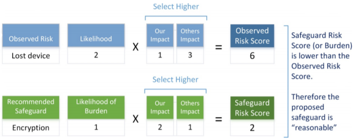

<!---DOC:CIS Risk Assessment Method;Notes I made on the CIS RAM and RAM Express documents;Sean Lewis-->
# CIS Risk Assessment Method (RAM)

> TL;DR: CIS RAM is an information security risk assessment method to help implement CIS Controls.

- [CIS Risk Assessment Method (RAM)](#cis-risk-assessment-method-ram)
  - [Risk Analysis Primer](#risk-analysis-primer)
    - [Introduction](#introduction)
    - [CIS Controls](#cis-controls)
      - [Goals](#goals)
      - [Key Actions](#key-actions)
        - [Basic](#basic)
        - [Foundational](#foundational)
        - [Organizational](#organizational)
      - [Further Reading](#further-reading)
    - [Principles and Practices](#principles-and-practices)
      - [Principles](#principles)
      - [Practices](#practices)
      - [Evolving Risk Analysis Methods](#evolving-risk-analysis-methods)
      - [Overview of the CIS Risk Assessment Method](#overview-of-the-cis-risk-assessment-method)
      - [Background – “Reasonableness” and Risk Analysis](#background-%E2%80%93-reasonableness-and-risk-analysis)
      - [Selecting A Tier for Your Risk Assessment Instructions](#selecting-a-tier-for-your-risk-assessment-instructions)
        - [**Tier 1**](#tier-1)
        - [**Tier 2**](#tier-2)
        - [**Tier 3** or **4**](#tier-3-or-4)
  - [CIS RAM Express Edition](#cis-ram-express-edition)
    - [About](#about)
    - [Risk Assessment Process](#risk-assessment-process)
    - [Developing the Risk Assessment Criteria](#developing-the-risk-assessment-criteria)
    - [Impact Criteria](#impact-criteria)
    - [Likelihood Criteria](#likelihood-criteria)
    - [Developing the Risk Acceptance Criteria](#developing-the-risk-acceptance-criteria)
    - [Modeling the Risks](#modeling-the-risks)
    - [Evaluating the Risks](#evaluating-the-risks)
    - [Recommending Safeguards](#recommending-safeguards)
    - [Evaluating Recommended Safeguards](#evaluating-recommended-safeguards)
      - ["Tier 2" Safeguard Evaluation Guidelines](#%22tier-2%22-safeguard-evaluation-guidelines)
      - [What to consider with the acceptability of safeguard risks](#what-to-consider-with-the-acceptability-of-safeguard-risks)
  - [Glossary](#glossary)
  - [Additional material](#additional-material)

## Risk Analysis Primer

### Introduction

Laws, regulations, and information security standards do not expect that the public can or will prevent all information security incidents. They instead make us responsible for looking ahead to what might go wrong, and to use safeguards that are not overly burdensome to prevent that harm. That is the essence of Duty of Care Risk Analysis4 (“DoCRA”) that the CIS RAM is based on.

- Since 1993, all US regulations – whether or not they are related to information security – require risk analysis to achieve a cost-benefit balance while achieving compliance.
- Information security standards have called on the public to use risk analysis when designing security controls that match their environment.
- Judges have used a “duty of care balance test” to determine liability in data breach cases.
- The Federal Trade Commission has consistently required that organizations use risk assessments to determine the reasonableness of their security controls.
- The General Data Protection Regulation (“GDPR”) that requires privacy protections for EU residents, and bases its security requirements on risk analysis.

### CIS Controls

#### Goals

The guidelines consist of 20 key actions, called critical security controls (CSC), that organizations should take to block or mitigate known attacks. The controls are designed so that primarily automated means can be used to implement, enforce and monitor them. The security controls give no-nonsense, actionable recommendations for cyber security, written in language that’s easily understood by IT personnel. Goals of the Consensus Audit Guidelines include to:

- Leverage cyber offense to inform cyber defense, focusing on high payoff areas,
- Ensure that security investments are focused to counter highest threats,
- Maximize use of automation to enforce security controls, thereby negating human errors, and
- Use consensus process to collect best ideas.

#### Key Actions

##### Basic

- CSC 1: [Inventory of Authorized and Unauthorized Devices](https://www.cisecurity.org/controls/inventory-and-control-of-hardware-assets/)
- CSC 2: [Inventory of Authorized and Unauthorized Software](https://www.cisecurity.org/controls/inventory-and-control-of-software-assets)
- CSC 3: [Secure Configurations for Hardware and Software on Mobile Devices, Laptops, Workstations, and Servers](https://www.cisecurity.org/controls/secure-configuration-for-hardware-and-software-on-mobile-devices-laptops-workstations-and-servers)
- CSC 4: [Continuous Vulnerability Assessment and Remediation](https://www.cisecurity.org/controls/continuous-vulnerability-management/)
- CSC 5: [Controlled Use of Administrative Privileges](https://www.cisecurity.org/controls/controlled-use-of-administrative-privileges)
- CSC 6: [Maintenance, Monitoring, and Analysis of Audit Logs](https://www.cisecurity.org/controls/maintenance-monitoring-and-analysis-of-audit-logs)

##### Foundational

- CSC 7: [Email and Web Browser Protections](https://www.cisecurity.org/controls/email-and-web-browser-protections)
- CSC 8: [Malware Defenses](https://www.cisecurity.org/controls/malware-defenses)
- CSC 9: [Limitation and Control of Network Ports, Protocols, and Services](https://www.cisecurity.org/controls/limitation-and-control-of-network-ports-protocols-and-services)
- CSC 10: [Data Recovery Capability](https://www.cisecurity.org/controls/data-recovery-capability)
- CSC 11: [Secure Configurations for Network Devices such as Firewalls, Routers, and Switches](https://www.cisecurity.org/controls/secure-configuration-for-network-devices-such-as-firewalls-routers-and-switches)
- CSC 12: [Boundary Defense](https://www.cisecurity.org/controls/boundary-defense)
- CSC 13: [Data Protection](https://www.cisecurity.org/controls/data-protection)
- CSC 14: [Controlled Access Based on the Need to Know](https://www.cisecurity.org/controls/controlled-access-based-on-the-need-to-know)
- CSC 15: [Wireless Access Control](https://www.cisecurity.org/controls/wireless-access-control)
- CSC 16: [Account Monitoring and Control](https://www.cisecurity.org/controls/account-monitoring-and-control)

##### Organizational

- CSC 17: [Security Skills Assessment and Appropriate Training to Fill Gaps](https://www.cisecurity.org/controls/implement-a-security-awareness-and-training-program)
- CSC 18: [Application Software Security](https://www.cisecurity.org/controls/application-software-security)
- CSC 19: [Incident Response and Management](https://www.cisecurity.org/controls/incident-response-and-management)
- CSC 20: [Penetration Tests and Red Team Exercises](https://www.cisecurity.org/controls/penetration-tests-and-red-team-exercises)

#### Further Reading

- The official list of the CIS Controls can be found [here](https://www.cisecurity.org/controls/cis-controls-list/).

### Principles and Practices

#### Principles

1) Risk analysis must consider the interests of all parties that may be harmed by the risk.
2) Risks must be reduced to a level that authorities and potentially affected parties would find appropriate.
3) Safeguards must not be more burdensome than the risks they protect.

#### Practices

1) Risk analysis considers the likelihood that certain threats could create magnitudes of impact.
2) Risks and safeguards are evaluated using the same criteria so they can be compared.
3) Impact and likelihood scores have a qualitative component that concisely states the concerns of interested parties, authorities, and the assessing organization.
4) Impact and likelihood scores are derived by a numeric calculation that permits comparability among all evaluated risks, safeguards and against risk acceptance criteria.
5) Impact definitions ensure that the magnitude of harm to one party is equated with the magnitude of harm to others.
6) Impact definitions should have an explicit boundary between those magnitudes that would be acceptable to all parties and those that would not.
7) Impact definitions address; the organization's mission or utility to explain why the organization and others engage risk, the organization's self-interested objectives, and the organization's obligations to protect others from harm.
8) Risk analysis relies on a standard of care to analyze current controls and recommended safeguards.
9) Risk is analyzed by subject matter experts who use evidence to evaluate risks and safeguards.
10) Risk assessments cannot evaluate all foreseeable risks. Risk assessments re-occur to identify and address more risks over time.

#### Evolving Risk Analysis Methods

- Calculating Risk Includes Multiple Impacts

CIS RAM uses the classic risk assessment calculation `Risk = Impact x Likelihood` with a few modifications. Most significantly, risk is calculated by multiplying a likelihood value by multiple impact values. These multiple impacts include impacts to the organization’s objectives, it’s mission, and is obligations to protect others. Organizations should be aware of the many ways that information security risk can create harm.

The risk calculation used by CIS RAM resembles the structure below:

```python
Risk = Max(Mission Impact, Objectives Impact, Obligations Impact) x Likelihood
```

Organizations that use this extended calculation will consistently consider the many ways that information security risks can create harm.

- Impact Definitions Include Harm to Multiple Parties

To ensure fairness and balance, impact definitions will include potential harm to individuals and organizations that may be impacted by risks. Impacts and impact magnitudes will be stated in qualitative and quantitative form to easily communicate levels of risk to all interested parties, and in a way that matters to each party.

- Risk Acceptance Is Clearly Defined

CIS RAM provides organizations with clear guidance for defining acceptable risk that appears fair to authorities and interested parties, and that can be consistently applied to all information security risks.

Acceptable risk will consider whether a observed risk is “appropriate” (all potentially affected parties would agree that the risk is acceptable), and whether a recommended safeguard is “reasonable” (it does not create more of a burden than the risk it protects against).

By expanding the definition of risk acceptance by these two factors, organizations will have an easily communicated rationale for accepting risk, or for prioritizing unacceptable risk.

- “Residual Risk” is Known As “Safeguard Risk”

“Residual risk” has traditionally meant the reduced amount of risk that remains after a security control has been implemented. Organizations have generally used “residual” to declare how a planned security safeguard presents acceptable risk. CIS RAM evolves the notion of a “residual risk” to “safeguard risk” to describe the risk that a new safeguard may pose.

By evaluating safeguard risk using the same criteria that are used to evaluate risks, organizations will be more cognizant of the true cost of controls, and will have a defensible way of stating whether recommended controls are overly burdensome to them or the public.

- Evolving Risk Acceptability

The image illustrates how CIS RAM evaluates “appropriate” risk using a simplified risk statement. In this scenario, an organization is analyzing a risk of a lost device, and estimates the likelihood and expected impact of the loss. Impact definitions estimate potential harm to the organization, and to others.

Using a scale of ‘1’ to ‘3’, the organization multiplies the likelihood score by the higher of the two impact scores to arrive at a risk score of ‘6’. In this example, an acceptable risk would be less than ‘4’, so the score of ‘6’ is not appropriate. “Others” would not accept the possibility of this risk.



#### Overview of the CIS Risk Assessment Method

- Using Risk Assessments to Design and Evaluate CIS Controls V7

CIS Controls V7 was designed to address the most common causes of security incidents in the general public. As a result, the CIS Controls are to a degree risk-prioritized, especially if organizations implement the first five CIS Controls before implementing the remaining 15. However, each organization has special circumstances, including the potential harm they may cause to others, the need to operate somewhat vulnerable systems based on their mission, the needs of their constituents, their available resources, and the foreseeability of threats in their industry.

The risk assessment method described by CIS RAM will help organizations determine whether their implementation of CIS Controls V7 – or their de-prioritization or customization of controls – is reasonable and appropriate given security, legal, and regulatory considerations. This risk assessment method describes multiple ways that organizations may evaluate, assess, and design safeguards using the CIS Controls.

In some cases, organizations may start simply and list the Controls to determine whether their information assets are sufficiently resilient against foreseeable threats. More capable organizations may list their information assets first, then consider whether associated CIS Controls sufficiently protect those assets against foreseeable threats. Organizations with a command of how threats operate may start with a list of known or foreseeable threats against information assets and determine how controls should be implemented to address them. Regardless, this risk assessment method will provide a model for organizations to evaluate risk based on the harm they may pose to themselves or their constituency, and to determine whether the burden of each of the CIS Controls – implemented as safeguards – are appropriate.

- Risk Assessment Process

A risk assessment is a project that analyzes the risk posed by a set of information assets, and recommends safeguards to address unacceptably high risks. While the order of events in a risk assessment project will vary from organization to organization, an analysis of the observed risk is normally made and safeguards are proposed.

- Analyze the Observed risk

  - Define the Scope: Identify information assets that are being assessed as well as the owners and stewards of the information assets.
  - Schedule Sessions: Schedule the interviews and sessions for evidence review.
  - Develop the Risk Assessment and Acceptance Criteria: Establish and define the criteria for evaluating and accepting risk.
  - Gather Evidence: Interview personnel, review documents, and observe safeguards.
  - Model the Risks: Evaluate the current safeguards that would prevent or detect foreseeable threats against the security of information assets.
  - Risk Evaluation: Estimate the likelihood and impact of security breaches to calculate the risk score, then determine whether identified risks are acceptable

- Propose Safeguards
  - Propose Safeguards: Recommend safeguards from CIS Controls V7 that would reduce unacceptable risks.
  - Evaluate Proposed Safeguards: Risk-analyze the recommended safeguards to ensure that they pose acceptably low risks without creating an undue burden.

- Risk Assessment Criteria

Risk analysis requires a consistent, repeatable method for estimating and evaluating risk. Risk assessment criteria provide organizations with measures for consistently rating the likelihood and impact of foreseeable threats that may compromise the security of information assets.

Risk assessment criteria are often thought of in terms of a 3 x 3 grid or a 5 x 5 grid, with each dimension representing either “likelihood” values or “impact” values. While scores of ‘1’ through ‘3’ or ‘1’ though ‘5’ are convenient for calculating risk as a product, they are not meaningful by themselves. So criteria must also have a plain-language component that describes levels of impact and likelihood that are meaningful to the organization.

Risk assessment criteria in a simplified format may appear similar to this:

| Impact Score | Impact Score Defined |
| --- | --- |
| 1 | No or minimal harm would result. |
| 2 | Harm would not be tolerable. |
| 3 | Harm may not be recoverable. |

| Likelihood Score | Likelihood Score Defined |
| --- | --- |
| 1 | Not foreseeable. |
| 2 | Expected to occur. |
| 3 | Regular occurrence. |

- Risk Acceptance Criteria

Laws and regulations require that organizations apply “reasonable” and “appropriate” safeguards to ensure that the resulting risk is acceptable. The acceptability of risk can be demonstrated using risk analysis that addresses the tolerability of the risk and the burden of safeguards that protect against the risk.

While every organization will define its own risk tolerance, this method provides a process for doing so using plain language and simple math. Consider the simplified impact and likelihood criteria from above. Organizations will develop their risk acceptance criteria by first defining what unacceptable risk is.

| Version | Definitions of Acceptable Risk |
| --- | --- |
| Plain language | We must reduce risks that are expected to create intolerable harm. |
| Mathematical | `Acceptable Risk < 2 x 2`; or `Acceptable Risk < 4` |

#### Background – “Reasonableness” and Risk Analysis

> The “reasonable person” is used in law as a hypothetical person – or legal fiction – who embodies the sum of our traditions, values, and responsibilities for taking care not to harm others while we engage in public life. The reasonable person has been used in cases to evaluate appropriate behavior for activities such as building and maintaining structures, offering goods and services, or handling assets such as information and information technologies. A reasonable person can engage in activities for their own benefit, but must take care, using appropriate precautions, not to harm others in the process.
> In litigation, a judge will often use a “duty of care” or “multi-factor” balancing test to determine the degree to which a defendant was acting reasonably when a plaintiff was harmed. And in regulations organizations must apply “reasonable” safeguards to protect others from harm. A judge’s duty of care balancing test is very similar in structure to this risk assessment method. An organization will consider foreseeable threats that their business may cause others. They will determine how effectively they prevent that harm by using CIS Controls V7 as a standard for appropriate cybersecurity practices. They will estimate the likelihood and impact of the expected harm of a foreseeable threat, and they will consider alternative safeguards that effectively lower risks without being overly burdensome. In this way, judges and cybersecurity practitioners use the same language to describe reasonable cybersecurity practices.
> In similar fashion, a regulator will ask regulated organizations to demonstrate the reasonableness of their safeguards by reviewing the organization’s risk register. Since 1993 US federal regulations require that regulatory rules are not overly burdensome to the public, and that a “cost-benefit” analysis is performed to determine whether regulatory actions are overly burdensome and appropriate to protect the public. Regulatory agencies, including those that govern cybersecurity rules and regulations, require risk assessments as the method for balancing the potential harm to others against the cost of safeguards.

#### Selecting A Tier for Your Risk Assessment Instructions

CIS RAM provides three sets of instructions, templates, exercises, and examples for conducting risk assessments, each with increasing complexity. These three sets of materials are suitable for Tier 1 organizations, Tier 2 organizations, and both Tier 3 and Tier 4 organizations.

> The reader can determine which of these levels and documentation are best suited to them by reviewing the characteristics provided below.

##### **Tier 1**

Materials are well-suited to organizations with the following characteristics:

- NIST Tier: Tier 1 organizations. Tier 1 materials are best suited for organizations that do not coordinate their information security plans and requirements throughout the organization. Information security is largely driven by technology management.
- Expertise: The organization is able to identify generic threats, but not specific methods for hacking systems, devices, and applications.
- Time: The organization can absorb the time needed to evaluate information risks at the level of generic systems, devices, and applications.

##### **Tier 2**

Materials are well-suited to organizations that enjoy more collaboration with business management, and have more resources and capabilities for analyzing security risks and planning programs.

- NIST Tier: Tier 2 organizations. Tier 2 materials are best suited for organizations that have at least some collaboration with non-technical business management to define risk criteria.
- Expertise: The organization has resources and capabilities to analyze common security threats, and to plan risk-appropriate safeguards. However, they do not have on-hand skills to model how threats would operate within their organization.
- Time: The organization is able to invest sufficient time to analyze risks at the level of specific systems, devices, and applications, and sub-components within those assets.

##### **Tier 3** or **4**

Materials are well-suited to organizations that receive security and threat information from outside sources, that have significant knowledge of information security topics, and time to evaluate threat scenarios that risk assessments are based on.

- NIST Tier: Tiers 3 and 4 organizations. Tiers 3 or 4 materials are best suited for organizations that are using risk-based criteria for enterprise-wide policies and processes.
- Expertise: The organization has resources and capabilities to analyze security threats, and to plan risk-appropriate safeguards, including the on-hand skills to model how threats would operate within their organization.
- Time: The organization is able to invest time to analyze risks at the level of specific systems, devices, and applications within the context of specific threats.

## CIS RAM Express Edition

### About

There were initially two provided pieces of documentation, the normal and the express version. This will cover the material from the **Express** edition and therefore might not have enough detail. However, it gives a good higher level view of how everything works.

### Risk Assessment Process

CIS RAM Express risk assessments involve the following activities:

- __Developing the Risk Assessment Criteria and Risk Acceptance Criteria:__ Establish and define the criteria for evaluating and accepting risk.
- __Modeling the Risks:__ Evaluate current implementations of the CIS Controls that would prevent or detect foreseeable threats.
- __Evaluating the Risks:__ Estimate the likelihood and impact of security breaches to arrive at the risk score, the determine whether identified risks are acceptable.
- __Recommending Safeguards:__ Risk-analyse the recommended safeguards to ensure that they pose acceptably low risks without creating an undue burden.

### Developing the Risk Assessment Criteria

CIS RAM Express evaluates risk using "Risk = Impact x Likelihood." This calculation will evaluate both _currently observed risks_ and _recommended safeguards_ so risk accessors can compare them and determine whether recommended safeguards are "reasonable."

Risk accessors will define their risk assessment criteria by creating definitions for "impact" and "likelihood". Criteria examples can be found in the [CIS RAM Workbook](https://learn.cisecurity.org/cis-ram).

### Impact Criteria

Definitions of an organization's:

- __Mission:__ the benefit that the interested parties gain from organization.
- __Objectives:__ the organization's goals.
- __Obligations:__ to protect others from harm.

Impact scores will state levels of magnitude ('1' through '5') to help estimate the impact from a threat.

Magnitudes '1' and '2' are shaded to reference acceptably low magnitudes.

| Impact Score | Impact to Objectives | Impact to Objectives | Impact to Obligations |
|---|---|---|---|
| 1 | Describe a negligible impact | Describe a negligible impact | Describe a negligible impact |
| 2 | Describe an acceptable impact | Describe an acceptable impact | Describe an acceptable impact |
| 3 | Describe an unacceptable impact | Describe an unacceptable impact | Describe an unacceptable impact |
| 4 | Describe a high impact | Describe a high impact | Describe a high impact |
| 5 | Describe an unrecoverable impact | Describe an unrecoverable impact | Describe an unrecoverable impact |

### Likelihood Criteria

Organizations may also define likelihood using a five-scale table. Likelihood scoring uses the familiar concept of "foreseeability" to ease estimation and communication. __The full CIS RAM describes techniques for using analysis such as the probability to refine likelihood estimation.__

| Impact Score | Impact Score Defined |
|---|---|
| 1 | Not foreseeable |
| 2 | Foreseeable, but unexpected |
| 3 | Expected, but no common |
| 4 | Common |
| 5 | Could be happening now |

### Developing the Risk Acceptance Criteria

Organizations will now have the basis for risk acceptance. By selecting the likelihood of an impact that they would start to invest against, they would conversely define risk levels that they would accept. For example, an organization that would invest against risks that are “Expected, but not common” (Likelihood is ‘3’) and that would cause an unacceptably high impact (Impact is ‘3’ or above’), their acceptable risk criteria could be stated like this:

| Impact Threshold | x | Likelihood Threshold | = | Risk Threshold |
|:-:|:-:|:-:|:-:|:-:|
| 3 | x | 3 | = | 9 |

Therefore, an acceptable risk would be one that comes out as below 9.

This example clearly shows how clearly defined risk assessment and risk acceptance criteria with consistent scoring can be easy to communicate.

### Modeling the Risks

Risks are modelled by associating information assets with the CIS Controls that protect them, the vulnerabilities that may be present, and the threats that may compromise the information assets. The full CIS RAM described three different ways for doing this, the following example is for a "Tier 2" company:

1) Identify an information asset or asset class, such as a specific firewall or a set of similarly managed firewalls, an application, or a set of identically configured servers, etc.
2) List the CIS Controls that would be appropriate for protecting that information or asset class.
   - This may lead to tens of controls for each information asset or asset class which would quickly overwhelm most organizations. The organization may reduce its effort by first performing a simple “Tier 1” risk assessment as described in CIS RAM. This enables them to first evaluate all CIS Controls as they are generally applied to the environment, then only evaluating specially configured controls for
each asset.
3) Describe whether and how the controls are implemented in the environment.
4) Consider any vulnerabilities that may exist related to each control. The risk accessor should take care to consider what may go wrong, even with the controls that are implemented correctly.
   - Examples of common vulnerabilities for controls that are completely implemented:
     - Errors in administration,
     - New threats,
     - Intentional harm, and
     - Insufficient skill.
5) Identify threats that could compromise the information assets or asset classes because of the vulnerabilities.

| Risk Analysis | Value |
|---|---|
| CIS Control | Identify a control from CIS Controls V7. |
| Description | Describe the controls as written in CIS Controls. |
| Information Asset | State the information asset or asset class that is being accessed. |
| Control | Describe whether or how the CIS Control is applied to the asset. |
| Vulnerability | State any vulnerability that may be exploited by a threat. |
| Threat | Describe an action that may compromise the asset's security. |

At this point, the risk assessor has formed a story about the security of its information assets: A set of valuable assets should be protected by CIS Controls. Some controls indicate vulnerabilities that may allow foreseeable threats to compromise the assets. But the organization still needs to know the acceptability and relative importance of the risks. The risk assessor is now ready to estimate the likelihood and impact of those risks.

### Evaluating the Risks

Because the risk assessor has impact and likelihood criteria already defined, they can select likelihood and impact values based on the descriptions in the definitions.

> Estimating likelihood and impact can be challenging for many risk assessors. While laws and regulations do not require “accurate” risk forecasting, organizations are best served by sound estimations. Guidance for estimating likelihood and impact is provided in the “Risk Analysis Techniques” chapter of CIS RAM, and includes method for systematic heuristics, and integration with probability analysis.

| Risk Analysis | Value |
|---|---|
| Threat Likelihood | Estimate the likelihood of the compromise. (1-5) |
| Mission Impact | Estimate the impact to the mission that would result. (1-5) |
| Objectives Impact | Estimate the impact to the objectives that would result. (1-5) |
| Obligations Impact | Estimate the impact to the obligations that would result. (1-5) |
| Risk Score | Multiply the likelihood score by the highest impact score. (1-5) |
| Risk Acceptability | Risk acceptability is automatically determined because the risk assessment criteria had been defined prior to the assessment. Scores below the risk acceptance criteria may automatically recorded as accepted by management. No ad hoc decisions need to be made. |

### Recommending Safeguards

Risks that evaluate to unacceptably high scores must be reduced by improving a control, or by applying new controls (known as “safeguards” when used for risk treatment). For example, if a software development team is not well trained and produces vulnerable web applications they may:

- Improve CIS Control 18.6 by training their team, or
- Introduce another safeguard such as a web application firewall according to CIS Control 18.10.

Each organization and environment will need to make choices about which CIS Control they will use to address a risk, but will also need to evaluate their recommended controls to determine whether they would effectively reduce risks while not creating new, unacceptable risks. That step is taken care of by evaluating the recommendations using the same risk assessment criteria that were used to evaluate the risk.

### Evaluating Recommended Safeguards

New safeguards will not necessarily reduce new risks. A reduced risk in one area (traditionally thought of as a 'residual risk') they can potentially create a new risk in another.

Some common examples of safeguards that increase risk are:

- New security controls that slow productivity
  - This may encourage personnel to find unsafe workarounds.
- Stringent access controls for information that is needed in critical situations, such as:  
  - Clinical care,
  - Emergency response, or
  - Monitoring volatile systems and processes
- Data protections that impede collaboration and research
- Encryption that prevents monitoring
- Controls that are excessively expensive

These can be considered **safeguard risks** that may harm an organizations missions, objectives and obligations. All of the CIS Controls that the organization would use to address the risks are good controls. **But security practitioners should implement the controls so that they meet the objective for reducing risks while not posing new risks.**

#### "Tier 2" Safeguard Evaluation Guidelines

| Risk Analysis | Value |
|---|---|
| Risk Score | The score of the original risk evaluation. |
| Risk Acceptability | Risk acceptability of the original risk score. |
| Recommended Safeguard | Describe how a CIS Control will be used to address the risk. |
| Safeguard Risk | Identify new risks to the mission, objectives, or obligations. |
| Safeguard Threat Likelihood | Estimate the likelihood that the safeguard risk would occur. |
| Safeguard Mission Impact | Estimate the impact to the mission that would result (1 - 5). |
| Safeguard Objectives Impact | Estimate the impact to the objectives that would result (1 - 5). |
| Safeguard Obligations Impact | Estimate the impact to the obligations that would result (1 - 5). |
| Safeguard Risk Score | Multiply the likelihood score by the highest impact score. |
| Safeguard Risk Acceptability | Risk acceptability of the risk score is automatically determined. |

#### What to consider with the acceptability of safeguard risks

1) As stated in Principle 2, Risks must be reduced to a level that all potentially affected parties would find appropriate. Risk assessors automatically adhere to this principle by acknowledging “Safeguard Risk Acceptability.”
2) Also recall Principle 3, Safeguards must not be more burdensome than the risks they protect against. Risk assessors can determine whether a recommended safeguard is overly burdensome by seeing if the safeguard risk is higher than the original risk.

It is generally true that if a safeguard risk score is acceptably low, then it is by default a reasonable treatment for an unacceptably high risk. However, the evaluation of “reasonable” risk treatments remain useful in two important ways:

1) Organizations that choose to reduce an acceptable risk should know whether the safeguard risk is higher than the original risk, even if they are both acceptably low. Why try to remedy an acceptable condition by making another condition that’s worse?
2) If a customer, a client, a legal authority, or a regulator requires a specific safeguard, organizations can model those safeguards to determine whether they create an unreasonably high burden. Such analysis may provide a convincing case that the requirement would increase risk.

## Glossary

- __Appropriate:__ A condition in which risks to information assets will not foreseeably create harm that is greater than what the organization or interested parties can tolerate.
- __Asset Class:__ A group of information assets that are evaluated as one set based on their similarity. “Servers,” “end-user computers,” “network devices” are examples, as are “email servers,” “web servers” and “authentication servers.”
- __Attack Path:__ A series of activities and information assets within the lifecycle of a security incident.
- __Attack Path Model:__ A description of how a specific attack path may occur within an environment.
- __Burden:__ The negative impact that a safeguard may pose to the organization, or to others.
- __Business Owners:__ Personnel who own business processes, goods, or services that information technologies support. i.e. customer service managers, product managers, sales management.
- __Constituents:__ Individuals or organizations that may be benefit from effective security over information assets, or may be harmed if security fails.
- __Control:__ A documented method for protecting information assets using technical, physical, or procedural safeguards.
- __Control Objective:__ The intended outcome of a control.
- __Due Care:__ The amount of care that a reasonable person would take to prevent foreseeable harm to others.
- __Duty of Care:__ The responsibility to ensure that no harm comes to others while conducting activities, offering goods or services, or performing any acts that could foreseeably harm others.
- __Impact:__ The harm that may be suffered when a threat compromises an information asset.
- __Impact Score:__ The magnitude of impact that can be suffered. This is stated in plain language and is associated with numeric scales, usually from ‘1’ to ‘3’ or ‘1’ to ‘5’.
- __Impact Type:__ A category of impact that estimates the amount of harm that may come to a party or a purpose. The CIS RAM describes three impact types; Mission, Objectives, and Obligations.
- __Information Asset:__ Information or the systems, processes, people, and facilities that facilitate information handling.
- __Inherent Risk:__ The likelihood of an impact occurring when a threat compromises an unprotected asset.
- __Key Risk Indicator:__ Aggregations and trending analysis of measures that management may use to understand their risk status.
- __Likelihood:__ The degree to which a threat is expected to create an impact. May be stated in terms of frequency, foreseeability, or probability.
- __Measure:__ A repeatable, evidence-based indication that a safeguard achieves its control objective.
- __Observed Risk:__ The current risk as it appears to the risk assessor.
- __Probability:__ The product of statistical analysis that estimates the likelihood of an event.
- __Reasonable:__ A condition in which safeguards will not create a burden to the organization that is greater than the risk it is meant to protect against.
- __Residual Risk:__ The risk that remains after a safeguard is applied. This concept is not directly used by CIS RAM, but implies that risk is lowered when a safeguard is applied. Residual risk does not take into account potential negative impacts to the organization when safeguards are applied.
- __Risk:__ An estimation of the likelihood that a threat will create an undesirable impact. In terms of this method, risk may be expressed as the product of a likelihood and an impact.
- __Risk Analysis:__ The process of estimating the likelihood that an event will create an impact. The foreseeability of a threat, the expected effectiveness of safeguards, and an evaluated result are necessary components of risk analysis. Risk analysis may occur during a comprehensive risk assessment, or as part of other activities such as change management, vulnerability assessments, system development and acquisition, and policies exceptions.
- __Risk Assessment:__ A comprehensive project that evaluates the potential for harm to occur within a scope of information assets, controls, and threats.
- __Risk Evaluation__: The mathematical component of risk analysis that estimates the likelihood and impact of a risk, and compares it to acceptable risk.
- __Risk Management:__ A process for analyzing, mitigating, overseeing, and reducing risk.
- __Risk Treatment Option:__ The selection of a method for addressing risks. Organizations may choose to Accept, Reduce, Transfer, or Avoid risks.
- __Risk Treatment Plan:__ A comprehensive project plan for implementing risk treatment recommendations.
- __Risk Treatment Recommendations:__ A listing of safeguards or processes that may be implemented and operated to reduce the likelihood and/or impact of a risk.
- __Safeguard:__ Technologies, processes, and physical protections that prevent or detect threats against information assets. Safeguards are implementations of controls.
- __Safeguard Risk:__ The risk posed by recommended safeguards. An organization’s mission or objectives may be negatively impacted by a new security control. These impacts must be evaluated to understand their burden on the organization, and to determine whether the burden is
reasonable.
- __Security:__ An assurance that characteristics of information assets are protected. Confidentiality, Integrity, and Availability are common security characteristics. Other characteristics of information assets such as velocity, authenticity, and reliability may also be considered if these are valuable to the organization and its constituents.
- __Steward:__ Personnel who are responsible for the security and proper operations of information assets, (e.g. database administrator, records manager, or network engineer).
- __Threat:__ A potential or foreseeable event that could compromise the security of information assets.
- __Threat Model:__ A description of how a threat could compromise an information asset, given the current safeguards and vulnerabilities around the asset.
- __Vulnerability:__ A weakness that could permit a threat to compromise the security of information assets.

## Additional material

- Download CIS controls [here](https://learn.cisecurity.org/cis-controls-download)