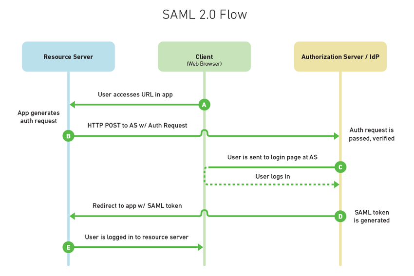
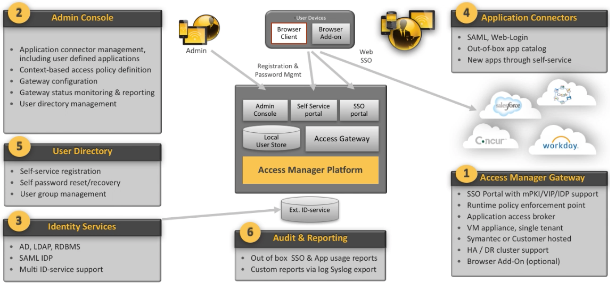
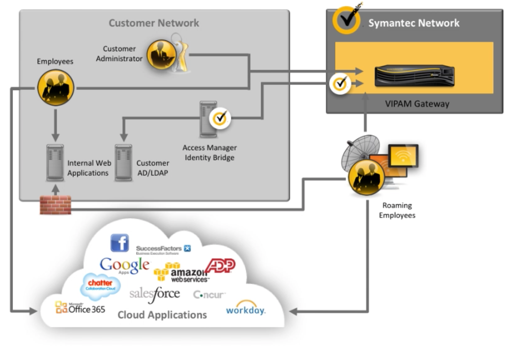
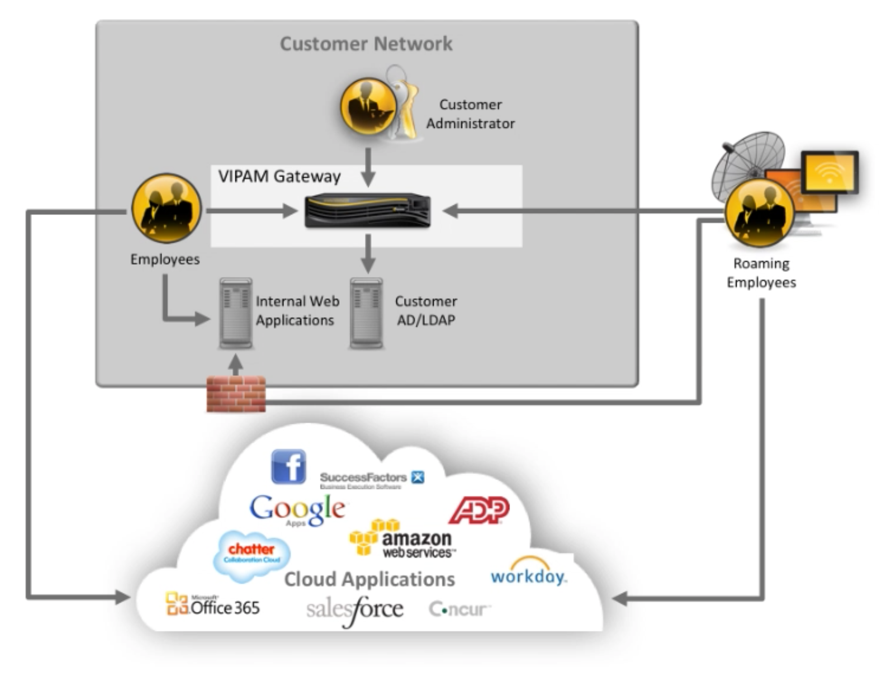

<!---DOC:Symantec VIP;Notes on Symantec VIP;Sean Lewis-->
# Symantec Validation and ID Protection (VIP)

## Table of Contents

- [Symantec Validation and ID Protection (VIP)](#symantec-validation-and-id-protection-vip)
  - [Table of Contents](#table-of-contents)
  - [About](#about)
    - [Overview](#overview)
    - [Symantec VIP Service](#symantec-vip-service)
    - [Symantec VIP Access Manager](#symantec-vip-access-manager)
    - [Example Scenario](#example-scenario)
  - [Introduction to Symantec VIP Access Manager](#introduction-to-symantec-vip-access-manager)
    - [Background](#background)
    - [Key Features of Cloud Sign-on services](#key-features-of-cloud-sign-on-services)
    - [VIP Access Manager - High Level](#vip-access-manager---high-level)
    - [Architecture of VIP Access Manager](#architecture-of-vip-access-manager)
      - [Hosted Deployment](#hosted-deployment)
      - [On-Premises Deployment](#on-premises-deployment)
    - [Installing Symantec VIP Access Manager](#installing-symantec-vip-access-manager)
      - [Installing: Hosted Deployment](#installing-hosted-deployment)
    - [Installing: On-Premises Deployment](#installing-on-premises-deployment)
    - [Keywords](#keywords)
  - [Enhance Security and Improve User Experience Through Single Sign-on](#enhance-security-and-improve-user-experience-through-single-sign-on)
    - [What is SSO about](#what-is-sso-about)
    - [VIP Access Manager](#vip-access-manager)
    - [Authenticating Users](#authenticating-users)
    - [Types of identity services](#types-of-identity-services)
  - [Control Access to Web Applications Based Upon Organizational Requirements](#control-access-to-web-applications-based-upon-organizational-requirements)
    - [Ways of creating application access policies](#ways-of-creating-application-access-policies)
    - [VIP Access Manager Access Control Policies](#vip-access-manager-access-control-policies)
  - [Enable Multi-factor Authentication Based Upon Business Requirements](#enable-multi-factor-authentication-based-upon-business-requirements)
    - [Application access based on Identity (level of assurance) LOA](#application-access-based-on-identity-level-of-assurance-loa)
    - [Integrate MFA with Access Manager](#integrate-mfa-with-access-manager)
      - [PKI Certificate Practices and Policies](#pki-certificate-practices-and-policies)

## About

### Overview

The Symantec Validation and ID Protection (VIP) Service is a multi-factor authentication (MFA) product that uses biometrics and smartphones to supplement standard username/password logins on a variety of servers and services. It is a cloud-based service for preventing unauthorized access to sensitive networks and cloud based services.

### Symantec VIP Service

- Cloud-based infrastructure
  - Secure, reliable, scalable, no on-premise server hardware required.
  - New capabilities transparently & automatically delivered.
- Broad choice of authentication options and credentials
  - Hardware one time password (OTP) tokens.
  - Free software/mobile OTP tokens.
  - Tokenless, transparent Risk-based authentication
- Password-less and Push login options
  - Biometrics eliminates password.
  - Push verification eliminates OTP.
- Self-service credential provisioning
  - No IT Help Desk needed.
- Enterprise infrastructure support
  - Out-of-box integrations.
    - RADIUS protocol:
      - Remote Authentication Dial-In User Service (RADIUS) is a networking protocol, operating on port `1812` that provides centralized Authentication, Authorization, and Accounting (AAA or Triple A) management for users who connect and use a network service.
      - Learn more about radius [here](https://www.cisco.com/c/en/us/support/docs/security-vpn/remote-authentication-dial-user-service-radius/12433-32.html).
    - Plug-ins (E.g., Microsoft ADFS, Oracle, Symantec VIP Access Manager).

### Symantec VIP Access Manager

- Single sign-on & single point of control
  - Consolidate passwords by logging on once
  - Enforce security and compliance policies for internal and mobile users
- Supports virtually any web-based application
  - Ready-to-use & Custom connectors
  - SAML
  - HTML forms
- Integrated support for strong authentication
  - One-time passwords, push, biometrics, risk-based authentication (Symantec VIP)
  - Digital certificates (Symantec Managed PKI)
- Self-service provisioning
  - Built-in user directory for registration and password management
  - Standards-based integration with identity providers
- Simplifies compliance
  - Easy, cost-effective cloud compliance audits and forensics

### Example Scenario

Here is an example company and their goaADFSls.

| GOAL | SOLUTION |
| :--- | :--- |
| Reduce costs associated with account proliferation and forgotten passwords | **VIP Access Manager*- SSO |
| Secure remote access with multi-factor authentication | **VIP Services*- OTP with RADIUS |
| Enable strong authentication in the commercial (consumer) application | **VIP Services*- Risk-based authentication |

## Introduction to Symantec VIP Access Manager

### Background

- Passwords are *BAD*: Bad habits are formed due to having to remember so many. A bad password can lead to accounts being compromised. Can be mitaged by:
  - By using SSO; improving user experience and reducing down to only one password that needs remembering.
  - Ensure that there is a strong password policy in place.
  - Implementing two factor authentication.
- SAML: Open standard for exchanging authentication and authoADFSrisation data between security domains.
  - A service provider (e.g. Google Apps, Salesforce, etc.) is configured to trust an IDP to authenticate users.
  - Uses public key encryption to establish a trust relationship.

- WS-Trust: Specification that uses secuADFSre message mechanisms of WS-Security to facilitate trust relationships in diverse Web service environments.
  - Intended for the exchange of user identity information in `Microsoft .NET 3.0`
  - WS-Trust defines a request/response process for exchange of security tokens in Kerberos, X.509 and SAML.
- WS-Trust is considered less complex and light weight, whereas SAML is more complex but considered more secure.

### Key Features of Cloud Sign-on services

- Directory integration
  - Should have integration with multiple user stores.
  - It will need to be able to federate multiple user directories.
- Application integration
  - Integration with web applications.
  - E.g. Salesforce, Office 365, etc.
- Policy Engine
  - Controls access to services and should consolidate multiple types of policy enforcement.
  - Should be reliable, flexible and have logging
- Layered protection
  - Support for certificates, multi factor and risk-based sign-on options
- User portal
  - Allows users to sign onto any of their applications in one place

### VIP Access Manager - High Level

Access Manager provides functionality to solve a range of identity and access issues:

- Single Sign On with Strong Authentication
  - SSO to any web application
  - Federation: SAML, WS-Trust, Direct
  - Plug-in for internal application and consumer sites
  - Extensive built-in app catalogue
- Access Management
  - Policies based on user's identity and session context
  - VIP, RSA and User certificate integration
  - Rich access audit logs
- User Management
  - Embedded virtual user directory
  - Self-Service registration, profile management, password reset
  - Use credential at SSO Portal to access Web applications

The **Application Catalogue*- has out-of-box connectors for applications and generic connectors for unlisted applications. Configurations can be imported or exported. It will also display _connector health_ at a glance.

**Access Control*- allows you to define access policies. They define access rules for applications based on user and device attributes, network location and Level of Assurance. Each application is assigned one access policy. Multi-factor authentication may be required when authentication needs to be stepped-up with a second factor such as a token.

### Architecture of VIP Access Manager

The _VIP Access Manager Gateway Appliance_ is a virtual appliance, which hosts the Single Sign-on portal and Administration console. First installed Gateway operates as configuration master. Additional gateways will be read-only. This means that, if the primary gateway goes down then configuration cannot be changed until it is back online or a new primary gateway is chosen. Used in Symantec-hosted or on-premises customer deployments.

The _VIP Access Manager Bridge Appliance_ is a virtual appliance which bridges externally hosted gateways to internally hosted Identity Service stores. It uses outbound HTTPS connections. It will be required if you are using IdP outside of the gateway network. It is optionally used for on-premises customer deployments.

#### Hosted Deployment

#### On-Premises Deployment

### Installing Symantec VIP Access Manager

An extended guide can be found [here](https://help.symantec.com/home/VIP_EG_INSTALL_CONFIG?locale=EN_US).

#### Installing: Hosted Deployment

- Complete provisioning form
- Receive account information
- Create additional administrator accounts
- Deploy identity bridges
- Configure applications and identity services

### Installing: On-Premises Deployment

- Prepare edge network
- Deploy gateways
- Enable SSL certificates and load balancing
- Configure administrators and alert settings
- Configure applications and identity services

### Keywords

- __IAS__: Identity and Authentication Services
- __SAML__: Security Assertion Markup Language
- __IdP__: Identity Provider
- __WS-Trust__: Web Services Trust
- __NTP__: Network Time Protocol
- __PKI__: Public Key Infrastructure is a set of roles, policies, and procedures needed to create, manage, distribute, use, store, and revoke digital certificates and manage public-key encryption.

## Enhance Security and Improve User Experience Through Single Sign-on

### What is SSO about

- SSO is about improving the end user experience
  - Security is just a side benefit.
- Federating directories
  - Users want immediate gratification.
  - Fewer user identities and easy access across resources.
- Multi-factor authentication
  - User perceive this as complicated.
  - Ease-of-use will increase user adoption.

### VIP Access Manager

- VIP Access Manager supports a variety of identity sources for single sign-on.
- 2nd factor authentication is supported.
- A variety of application connectors are available out-of-box.
  - There are a collection of connectors available at the application catalogue.
  - New connectors can be created, imported and exported.
- Users access applications from the SSO partal based on rules.

### Authenticating Users

| Authentication & Authorisation | Identity Services |
| :--- | :--- |
| > Authentication - Positively establishes a user's identity. | > Authenticates users using LDAP, Database, Client Certificates, Remote SAML Identity Provider or Local User Store |
| > Authorisation - Policy-based access determined by identity, device and location.   | > Federates across multiple identity services providing attribute normalisation for authorisation. |
| | > Supplements authentication providing higher levels of assurance. |

### Types of identity services

Primary Authentication

- Delegated authentication to:
  - Active Directory
  - LDAP
  - Database
  - Local User Database
  - Managed PKI
  - SAML Identity Providers

Secondary Authentication

- Multi-Factor Authentication
- Increased Level of Assurance
- VIP One-time-password and RSA tokens

Supplementary Authentication

- Alternative source of identity attributes for policy decisions or SAML contracts
- Query external AD, LDAP or Database service for identity information
  - Example: HR Database

## Control Access to Web Applications Based Upon Organizational Requirements

THe business wants to:

- Secure web application logon and minimise exposure of information to protect corporate secrets and reduce legal risk.

IT and other groups want to:

- Fulfil the business requirements
- Deploy web applications across the users with minimal cost and resources involved.
- Make it easy for end-users so that they will use the system.
- Have a good auditing and logging system.

Access control in our definition does not govern actions within the target application - it disables the password sign-in for the application. This helps by limiting the access to the right people to specific applications, ensuring secure authentication to an application to protect data, etc.

### Ways of creating application access policies

Default user attributes:

- Username
- Email
- Admin role

Additional user attributes:

- From an identity service
- From supplementary sources
- PKI or other authorisation providers
- (**NOTE: Must be mapped to appear as a condition**)

User context attributes:

- Based on IP Address
- Headers from the User-Agent
- Current date
- Geolocation

### VIP Access Manager Access Control Policies

Access policies define rules based on user and device attributes, network location and level assurance. Each application is assigned one access policy. In Access Manager, the access policies are made up of three primary components; order, condition and action. Conditions are evaluated hierarchically per the order in the access policy. If the condition is evaluated as `true` the action is performed. If it returns `false`, the next condition will be evaluated. If there are no conditions left, a final action will be performed; this is typically to deny access. Condition logic works like normal "contains," "is equal to," etc. Actions include `Permitting` or `Denying access request` or `Permitting with LOA1-4`. Default Access Policies exist, with Admin and All Users.

You can apply variable levels of access control based on known risk factors such as type of data accessible to the user. For example, based on the role you can step up the authentication requirement - if they are claiming to be high up in sales and want to access `Salesforce` then force them to use multi-factor authentication. This can be done based on location as well, if their IP address suggests they are outside the office or in a foreign country they can be forced to provide additional authentication.

Some considerations for policies:

- Too many rules can make for difficult diagnostic and auditing procedures.
- Group matching for Active Directory and LDAP users is based on the distinguished name of the group; a simple substring match may not be precise enough.
- Proxy-based load balancers, which are rare, can obscure device IP address invalidating rules based on network location.

## Enable Multi-factor Authentication Based Upon Business Requirements

### Application access based on Identity (level of assurance) LOA

- Perform risk assessment to determine minimum required identity LOA for each application.
- The LOA of an identity can be increased by requiring multi-factor authentication.
- Step-up authentication is secondary authentication requesting a 2nd factor in order to increase identity LOA.
- Multi-factor authentication (MFA) uses different authentication factor types:
  - Something You Know
  - Something You Have
  - Something You Are

### Integrate MFA with Access Manager

- Integrating strong authentication for higher levels of assurance (LOA).
- Integrating MFA at a single control point to:
  - Increase usability and convenience.
  - Reduce IT burden by avoiding MFA integrations at each end application.
  - Selectively require MFA (step-up authentication) based on policy rules.
- MFA with VIP Login and/or PKI can eliminate the password, providing improved _security and convenience_.
- Symantec VIP and Managed PKI integrate seamlessly with VIP Access Manager.
- Third-party vendor integrations using open standards (SAML, RADIUS).

#### PKI Certificate Practices and Policies

> PKI certificate practices and policies must support Access Manager policies and LOA

- Identity Proofing
  - Certificate vetting and approval must meet or exceed the identity LOA required by the Access Manager
- Multi-factor Authentication Credential
  - A certificate alone is only one factor (Something You Have).
  - Require PIN (Something You Know) or Biometric (Something You Are) for MFA Certificate Credential.
  - Stronger ID proofing and hardware token storage needed for highest LOA.
